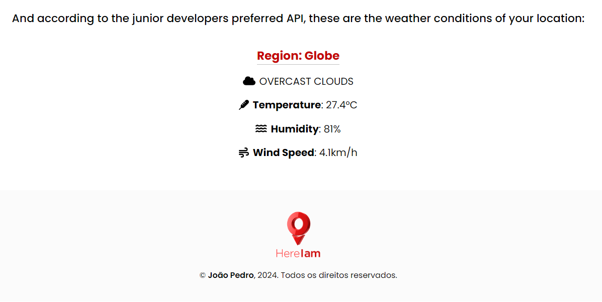

# React Project: **Here I am**

### Overview: This is a responsive application that uses the Google Maps API and the Open Weather API to define the user's location on the map and show the weather forecast/weather conditions in the location.
##### The subtitle 'how do you do' is just a cheap pun.

<!--  -->



## Step by step configuration:

1. Clone the repository:
    ```sh
    git clone https://github.com/joaopedronm/here-i-am.git
    cd here-i-am
    ```

2. Create a `.env` file at the root of the project and add your API keys:
    ```sh
    VITE_API_KEY_GOOGLE_MAPS=your_api_key_1
    VITE_API_KEY_OPEN_WEATHER=your_api_key_2
    ```
    OBS: This is a crucial setting. To get your Google Maps API, follow the instructions in the official documentation: [Google Maps API JavaScript](https://developers.google.com/maps/documentation/javascript).
    And to get your Open Weather API, follow the instructions on the official documentation page: [Open Weather Api](https://openweathermap.org/api). On both platforms you will have to create an account and get your own API.


3. Install dependencies:
    ```sh
    npm install
    ```


4. Install the necessary libraries:
    ```sh
    npm install @react-google-maps/api axios @fortawesome/react-fontawesome @fortawesome/fontawesome-svg-core @fortawesome/free-solid-svg-icons @fortawesome/free-brands-svg-icons --save-dev jest @testing-library/react @testing-library/jest-dom @testing-library/user-event @babel/core @babel/preset-env @babel/preset-react babel-jest identity-obj-proxy jest-environment-jsdom
    ```


5. Start the application:
    ```sh
    npm run dev
    ```


## Unit Tests - *Notes*

For the tests to work correctly, you must modify line 13 of the Mapa.jsx file and line 22 of the Weather.jsx file, replacing the calls via .env and placing the API keys directly.
I'll fix this configuration later to make the tests more fluid.

---
---
---

### If you come across any bugs, please don't hesitate to open an issue on our GitHub repository. I also welcome suggestions for improvements or new features through GitHub issues. If you're interested in contributing code, feel free to fork the repository, make your changes, and submit a pull request. I'll review it promptly.

#### Connect with me:
[](https://www.linkedin.com/in/joaopedronascimento/)
[](https://github.com/joaopedronm)
[](https://mrfrontend.tech/)